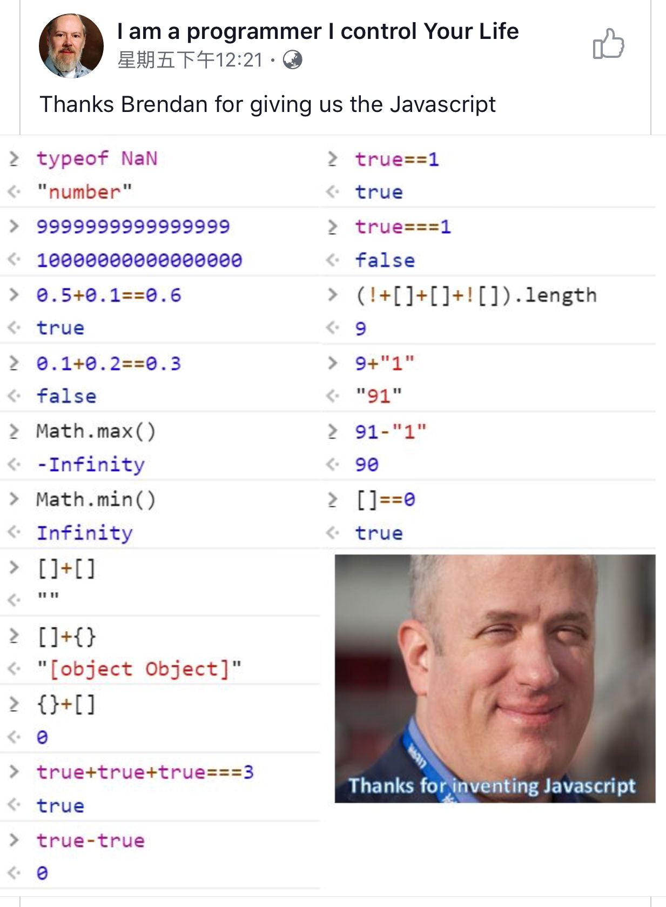

# 神奇的 JavaScript


(圖片來源：網路)


````js
console.log(typeof null); // "object"

console.log(typeof NaN); //"number"
console.log(9999999999999999); //10000000000000000

var x = 0.5 + 0.1;
console.log(x); //0.6

var x = 0.1 + 0.2;
console.log(x); //0.30000000000000004

var x = Math.max(2, 5, 6);
console.log(x); //6

var x = Math.max();
console.log(x); //-Infinity

var x = Math.min(2, 5, 6);
console.log(x); //2

var x = Math.min();
console.log(x); //Infinity

var x = [];
console.log(x); // []


console.log( [].toString() ); // ""
console.log( ([]).toString() ); // ""
console.log( ({}).toString() ); //"[object Object]"
console.log( ([]).length ); // 0
console.log( ({}).length ); // undefined
console.log( Number([]) ); // 0
console.log( Number({}) ); // NaN


console.log( []+[] ); // ""
console.log( []+{} ); //"[object Object]"
console.log( 0+{} ); // "0[object Object]"
console.log( []==0 ); // true


console.log( true ); // true
console.log( Number(true) ); // 1
console.log( Number(true) ); // 0
console.log( true+true+true ); // 3
console.log( true-true ); // 0
console.log( true==1 ); // true
console.log( true===1 ); // false

console.log( 9+"1" ); // "91"
console.log( 91-"1" ); // 90


console.log( {}+[] ); // 0 (why???)
console.log( (!+[]) ); // true (why???)
console.log( (![]) ); // false (why???)
console.log( ([]+![]) ); // "false" (why???)
console.log( (!+[]+[]+![]) ); // "truefalse"
console.log( (!+[]+[]+![]).length ); // 9
````

